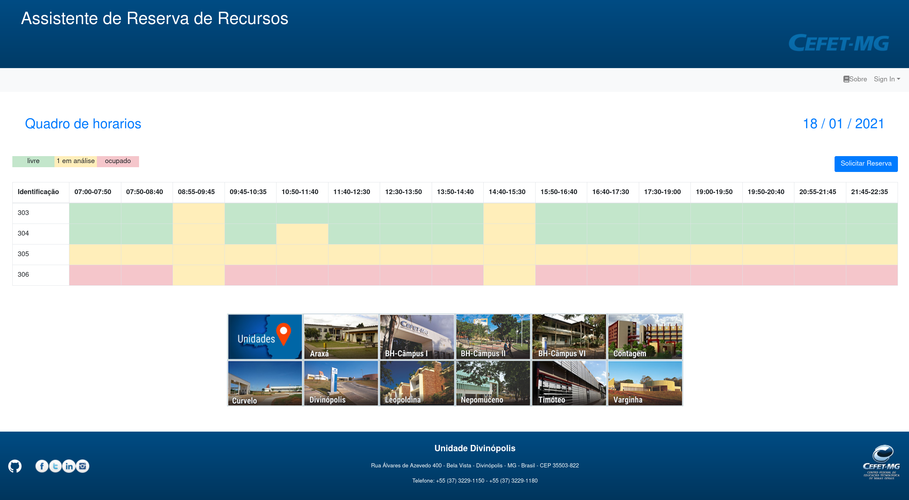

# Chronus

Esse projeto foi desenvolvido por dois alunos do segundo período do curso de Engenharia de Computação do CEFET-MG Campus V, Lucas Martins Soares e Vitor Martins Soares, orientados pelo diretor da instituição Emerson De Sousa Costa e coorientados por Tiago Alves De Oliveira, com o objetivo de otimizar o processo de reserva dos recursos físicos no CEFET.

## Como executar o projeto

### Instale as dependencias do FRONTEND  e execute-o no modo de desenvolvimento
```
npm i
npm run serve
```

### Instale as dependencias do BACKEND DE TESTE
```
cd /backend
npm i
npm start
```

### URL do backend
```
http://localhost:3003/
```
### URL do frontend
```
http://localhost:8080/
```



<!-- ### Compiles and minifies for production
```
npm run build
```

### Lints and fixes files
```
npm run lint
```

### Customize configuration
See [Configuration Reference](https://cli.vuejs.org/config/). -->
